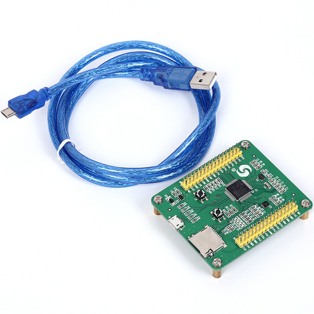
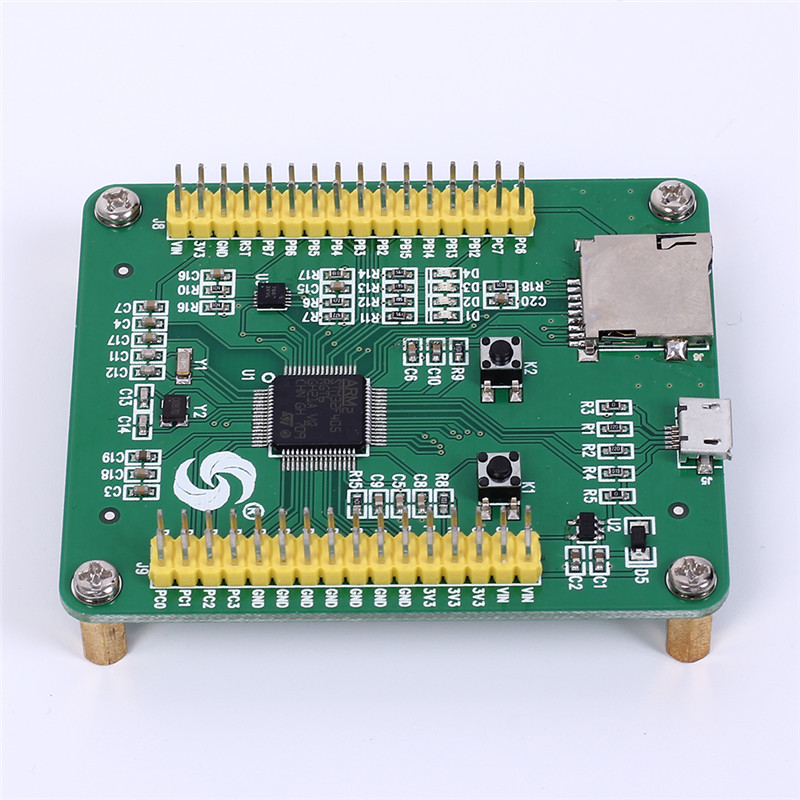
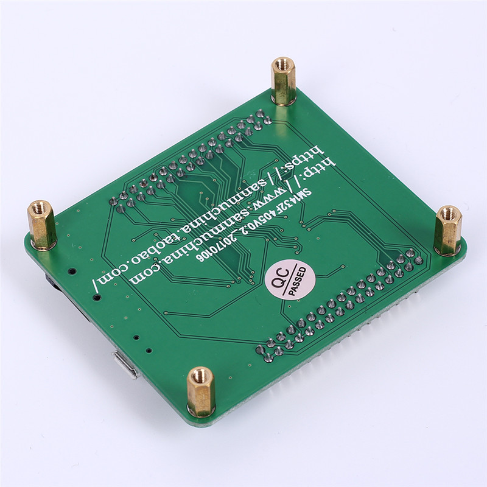

# Micropython PyBoard v3 (compatible) - sanmuchina.com
I got a micropython board from Aliexpress and was impressed of the quality of the board. On this page I share all what may be helful for you to use this board. The micropython project is *outstanding*. Buy such a board an have fun!

## Board from Aliexpress
- sanmuchina.com
- SM1432F405V0.2_20170106
- USD 17





## My rating of this board
I like the board for these reasons
- The board seems to be PyBoard v3 compatible.
- Physically big: Pin names are readable. Plenty of room for stackable header.
- All I tested worked as expected.
- Cheap. Cheap delivery.

Cons
- It took me some while to find out what I collected in `Good to know`.

## Good to know
### This is a PyBoard v3
All what applies to PyBoard v3 applies to this board. The physical layout is different but electrically equals. Therefore the PyBoard v3 Firmware and the Python examples run on this board.
### Buttons
Name | Pyboard | sanmuchina
-|-|-
Reset | `RST` | `K1`
User | `USR` | `K2`

### Pin assignement
See [example_pins/readme.md](example_pins/readme.md)

### This firmware should work
Pick *Firmware suitable for hand-made PYBv3 boards* on http://micropython.org/download

### Assembly/Pinout/Schemata for PyBoard v3
https://github.com/micropython/pyboard/blob/master/assembly/assembly.pdf
https://github.com/micropython/pyboard/blob/master/pinout/pybv3/pinout.png
https://raw.githubusercontent.com/micropython/pyboard/master/schem.png

### Eagle and Gerber
https://github.com/micropython/pyboard/tree/master/gerber
https://github.com/micropython/pyboard/tree/master/eagle

# Compile and flash the firmware
# Compile
Clone
https://github.com/micropython
and compile:
```
cd micropython/ports/stm32cubemx
make BOARD=PYBV3
sudo make BOARD=PYBV3 deploy
```

## Flash
Bring the board in dfu-bootloader-mode
- On the Python prompt type: `pyb.bootloader()`
- Or: Connect pins `BOOT0` with pin `3.3V`. Press `Reset` button

Now flash:
```
sudo make BOARD=PYBV3 deploy
```

