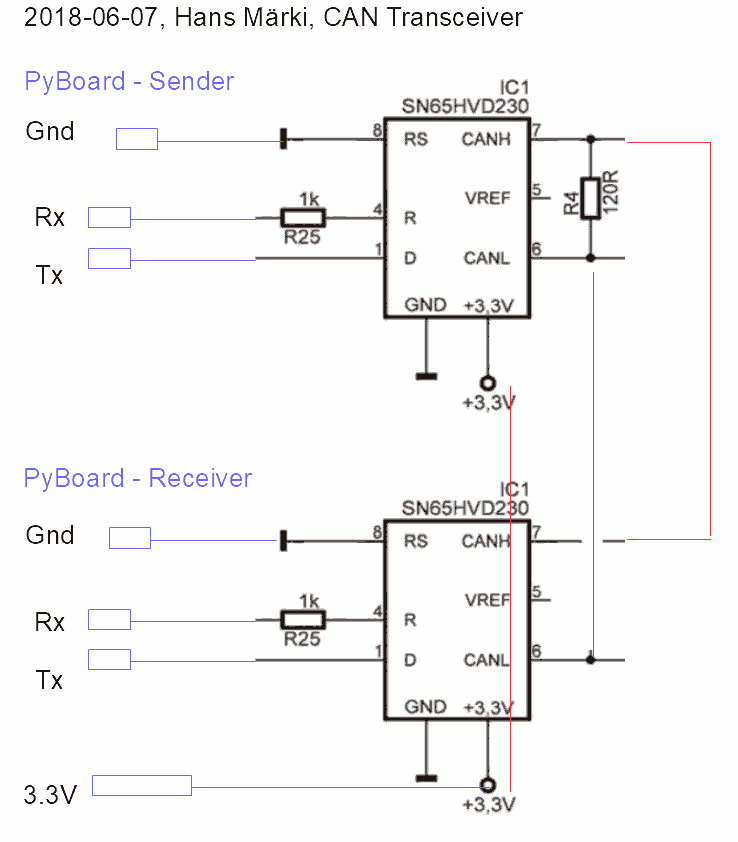

# Can-Demo-App

# How it works
Two micropython boards are connected via a CAN bus.

## Sender
- Pressing the *USER*-button will send `b'on'` to the CAN-id `123`.
- Releasing the *USER*-button will send `b'off'` to the CAN-id `123`.

```
>>> import canbus_sender
Press Switch to send CAN-telegrams, press <ctrl-c> to abort.
sending b'on' to Id 123
sending b'off' to Id 123
sending b'on' to Id 123
```

## Receiver
- Waits for CAN-telegrams for CAN-ids `122`, `123`, `124` and `125`.
- When a CAN-telegram arrives it switches the LED *on* if the telegram is `b'on'`.

```
>>> import canbus_receiver_interrupt
Now listening on these CAN-id's:  (122, 123, 124, 125)
>>> received: b'on'
received: b'off'
received: b'on'
```

# Implementation
It is about the simples program to demonstrate CAN-bus communication.
There are two receiver: `canbus_receiver_polling.py` is polling in the main-loop. `canbus_receiver_interrupt.py` gives the main-loop free but a interrupts service is called whenever a CAN-telegram arrives.

# Baud-Rate-Table
The settings for the baudrates may be evaluated by the following script.
**Note that the values are only valid for STM32F4 processors running on 168MHz.**
```
>>> import canbus_baudrate
This is a pyboard version v1.9.4 on 2018-06-03. PYBv3 with STM32F405RG
1000.00 kBaud: can = CAN(1, CAN.NORMAL, prescaler=4, bs1=14, bs2=6)
800.00 kBaud: can = CAN(1, CAN.NORMAL, prescaler=5, bs1=14, bs2=6)
500.00 kBaud: can = CAN(1, CAN.NORMAL, prescaler=8, bs1=14, bs2=6)
400.00 kBaud: can = CAN(1, CAN.NORMAL, prescaler=10, bs1=14, bs2=6)
250.00 kBaud: can = CAN(1, CAN.NORMAL, prescaler=16, bs1=14, bs2=6)
200.00 kBaud: can = CAN(1, CAN.NORMAL, prescaler=20, bs1=14, bs2=6)
160.00 kBaud: can = CAN(1, CAN.NORMAL, prescaler=25, bs1=14, bs2=6)
125.00 kBaud: can = CAN(1, CAN.NORMAL, prescaler=32, bs1=14, bs2=6)
100.00 kBaud: can = CAN(1, CAN.NORMAL, prescaler=40, bs1=14, bs2=6)
80.00 kBaud: can = CAN(1, CAN.NORMAL, prescaler=50, bs1=14, bs2=6)
50.00 kBaud: can = CAN(1, CAN.NORMAL, prescaler=80, bs1=14, bs2=6)
40.00 kBaud: can = CAN(1, CAN.NORMAL, prescaler=100, bs1=14, bs2=6)
32.00 kBaud: can = CAN(1, CAN.NORMAL, prescaler=125, bs1=14, bs2=6)
25.00 kBaud: can = CAN(1, CAN.NORMAL, prescaler=160, bs1=14, bs2=6)
20.00 kBaud: can = CAN(1, CAN.NORMAL, prescaler=200, bs1=14, bs2=6)
16.00 kBaud: can = CAN(1, CAN.NORMAL, prescaler=250, bs1=14, bs2=6)
10.00 kBaud: can = CAN(1, CAN.NORMAL, prescaler=400, bs1=14, bs2=6)
```


# Schematic
You need two external CAN-transceivers (one for the sender and one for the receiver board). I used [SN65HVD23 from TI](http://www.ti.com/lit/ds/symlink/sn65hvd230.pdf).



